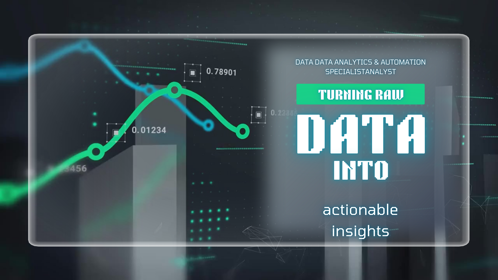

  

# Iván Díaz

**Data, BI & Automation Consultant** · I build and run the systems, not just the reports.

I spent ten years managing operational data — databases of hundreds of thousands of records in government banking, reporting for audits — and years guiding visitors through Chiapas. That taught me something a course does not: systems fail when they ignore how people actually work.

So I stopped stopping at the dashboard. Today I design, build, deploy and operate the systems that produce the numbers: multichannel inventory, offline-first field apps, sales agents running on local AI, multi-tenant B2B platforms, and the BI on top of all of it. I run my own infrastructure — around 60 containers on a self-hosted server, zero open ports, published over an encrypted tunnel, with documented backup and rollback on every project.

**Datos que no mienten.** / **Data that doesn't lie.**

---

## What I do

| | |
|---|---|
| **Dashboards & BI** | From raw data to executive dashboards that a business owner reads without me in the room. |
| **Operations automation** | Inventory, WhatsApp, invoicing, reporting — the manual work that quietly eats a team's week. |
| **Custom systems** | PWAs and web apps built so the owner can run them alone. |
| **Technical audits** | Measured diagnosis of existing sites and systems. Numbers, not opinions. |

---

## Featured work

Production systems built in 2026. Each links to a full case study — context, key decisions and their reasoning, architecture, and results.

| Project | The problem it solves | Stack | Case study |
|---|---|---|---|
| **Multichannel operations hub** | Three isolated inventories and sales that landed in none of them. Consolidated into one append-only ledger: 1,742 movements, 90-day queries in 3.5 ms, 143 automated tests. | Node.js · TypeScript · PostgreSQL | [Read](https://ivandiazlab.com/detalle-centro-operaciones-en.html) |
| **Offline-first warehouse PWA** | 512 units shipped, 408 deducted. Rebuilt on event sourcing and proven with a deterministic replay of 3,536 real events. | PWA · Event sourcing · IndexedDB | [Read](https://ivandiazlab.com/detalle-bodega-offline-en.html) |
| **WhatsApp sales agents on local AI** | Sales conversations answered around the clock without a single message leaving the machine. Ported to a second business via a portability guide. | Ollama · pgvector · hybrid search | [Read](https://ivandiazlab.com/detalle-agentes-whatsapp-en.html) |
| **Quoting tool with a public link** | Clients open the quote in the browser; margins and costs are verified at runtime to never leave the server. | Node.js · PostgreSQL | [Read](https://ivandiazlab.com/detalle-cotizador-en.html) |
| **Multi-tenant B2B platform** | Tenant isolation enforced in the database (RLS), with automated tests that prove data cannot leak across tenants. | PostgreSQL RLS · TypeScript | [Read](https://ivandiazlab.com/detalle-plataforma-b2b-en.html) |
| **SIGO — convention bureau management** | A full management system delivered across 13 phases, 67 automated tests, public demo. | TypeScript · PostgreSQL | [Read](https://ivandiazlab.com/detalle-sigo-en.html) |

**[How I work: 60 containers, zero open ports →](https://ivandiazlab.com/como-trabajo-en.html)** — the infrastructure and the operating discipline behind all of the above: backups, verification gates, rollback, and an AI-assisted engineering method with separated planning, building and verification roles.

**[All 26 cases →](https://ivandiazlab.com/projects-en.html)**

---

## Tech

**Data** Python (Pandas, NumPy) · SQL · Exploratory data analysis · A/B testing
**BI** Tableau · Looker Studio · Power BI · KPI design · Dimensional modelling
**Engineering** Node.js · TypeScript · PostgreSQL · Astro · React
**Automation** Google Apps Script · REST APIs · Multi-source data pipelines
**Operations** Docker · Automated testing · Deploy with backup and rollback

---

## Analytics fundamentals

Where the data work started. Academic projects from my TripleTen professional certification — kept because the analysis is sound, not because they are the headline.

| Project | Focus | Repo |
|---|---|---|
| Telecom churn analysis | Churn prediction and retention | [Repo](https://github.com/kutusho/Sprint-10-Eficiencia-Operativa-y-Predicci-n-de-Churn) |
| Showz marketing analytics | Campaign performance with SQL | [Repo](https://github.com/kutusho/Sprint-9-An-lisis-de-Datos-con-SQL) |
| CallMeMaybe A/B test | Hypothesis testing and retention | [Repo](https://github.com/kutusho/Sprint-8-An-lisis-de-A-B-Testing-y-Validaci-n-de-Hip-tesis) |

---

## Contact

**Portfolio** [ivandiazlab.com](https://ivandiazlab.com) · **CV** [English](https://ivandiazlab.com/assets/docs/cv-ivan-diaz-en.pdf) · [Español](https://ivandiazlab.com/assets/docs/cv-ivan-diaz-es.pdf)
**Email** ivandiaztpv@gmail.com
**LinkedIn** [ivan-diaz-data-analyst](https://linkedin.com/in/ivan-diaz-data-analyst)

Based in San Cristóbal de Las Casas, Chiapas, Mexico. Working with clients in Mexico and the United States, in Spanish and English.
